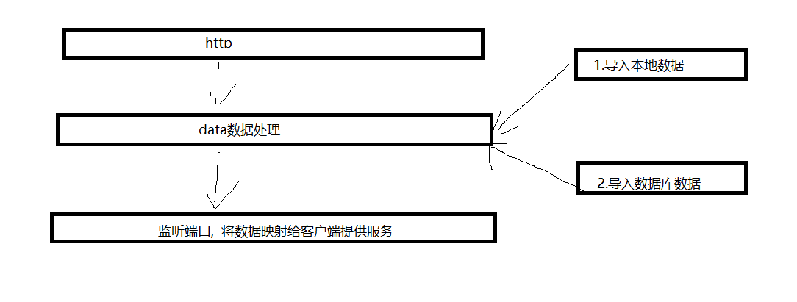
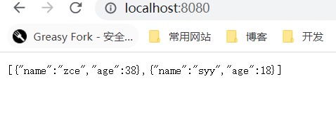

## node

## 零 基础知识

### 0.0 全局对象

global

#### 0.0.1 常见的全局变量

``` js
__filename: 返回当前执行脚本的绝对路径
__dirname: 返回当前执行脚本的所在目录

timer类函数: 执行顺序与事件循环之间关系

process: 与当前进程互动接口

require: 导入模块

module,exports: 导出模块
```

#### 认识全局变量

``` js
// console.log(global);

console.log(__filename); //返回执行文件路径
console.log(__dirname); //返回目录
console.log(this); // 默认情况下 this是空对象,和global 并不同

console.log(this == global);// false


(function () {
    console.log(this == global);// true
    
})()

/* 
默认情况下node 会注入如下模块
require('module')
__filename
__dirname
module
exports
*/


```

#### 0.1.0 全局对象----process

> 无需require
>
> + 1. 获取进程信息
> + 2. 执行进程操作, 监听进程
> + 3. 

``` js
// 1. 资源 cpu 内存

console.log(process.memoryUsage());
console.log(process.cpuUsage());

// 2. 运行环境:运行目录, node 环境 cpu架构, 用户环境 ,系统平台


console.log(process.cwd());
console.log(process.version);
console.log(process.versions);
console.log(process.arch);
console.log(process.env);
// 获取当前环境 * 
console.log(process.env.NODE_ENV);


// 当前平台
// console.log(process.platform);


// 3. 运行状态: 启动参数, PID, 运行时间
console.log(process.argv);
console.log(process.argv0); //arg 0 获取第一个
console.log(process.argv[0]); 
// 所以，我们只要从 process.argv[2] 开始获取就好了

const args = process.argv.slice(2);
console.log(args);// 进程id


console.log(process.pid);// 进程id

console.log(process.uptime());// 从运行开始到现在的时间
setTimeout(()=>{
    console.log(process.uptime());// 从运行开始到现在的时间
},3000)


// node .\4.process.js 1
// node .\4.process.js --a 1 
// var a = args[1]

// 4. 事件监听
// process.on('exit', (code)=>{
//     console.log('exit' + code);
    
// })


// process.on('beforeExit', (code)=>{
//     console.log('beforeExit' + code);

    
// })

// process.exit() // 函数退出

console.log('代码执行完毕');


// 5.标准输入  输出  错误

// console.log = function(data){
//     process.stdout.write('----' + 'data' + '\n')

// };


// console.log(111);

```


## 一 事件驱动

``` js
// 事件驱动机制
const EventEmitter = require('events')

const myEvent = new EventEmitter();    

myEvent.on('事件1', ()=>{
    console.log('事件1执行了');
})


myEvent.on('事件1', ()=>{
    console.log('事件1-2执行了');
})


myEvent.emit('事件1')
```

## 二 单线程

异步IO , 事件驱动,事件循环

``` js
// node js 单线程

// 延迟4s后启动服务
function sleepTime(time) {
    const sleep = Date.now() + time * 1000
    while( Date.now() < sleep){}
    return 
}

sleepTime(4)
// 1. http 服务开启

const http = require('http') 

// 2. 发送给客户端的内容
const server = http.createServer((req,res)=>{
    res.end('server starting...')
})

// 3. 开启一个监听端口
server.listen(8080, ()=>{
    console.log('服务已启动');
    
})
```

## 三 应用场景

> 不适用于大量业务,适用于IO密集型应用

``` 
# 1. 操作数据库,提供api
# 2. 实时聊天应用程序

```

### 3.1 nodejs 实现API服务




#### 3.1.1 框架搭建

```js 
npm init -y
npm i typescript -S
tsc --init // 生成ts配置

```

安装能直接运行ts的脚本工具

```js
npm i ts-node -D
```

执行ts文件

> $  ts-node .\api_server.ts

安装express

``` 
npm i express
```


```js
npm i @types/express -D
```


#### 3.1.2 数据获取

方式1 : 导入本地json文件

方式2: 后续从数据库中读取





